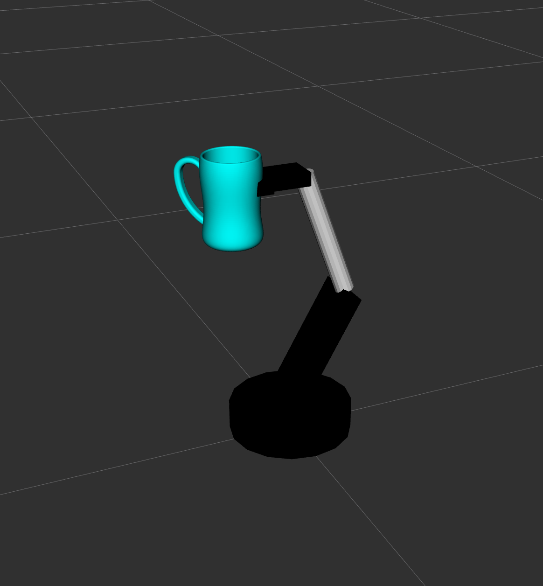
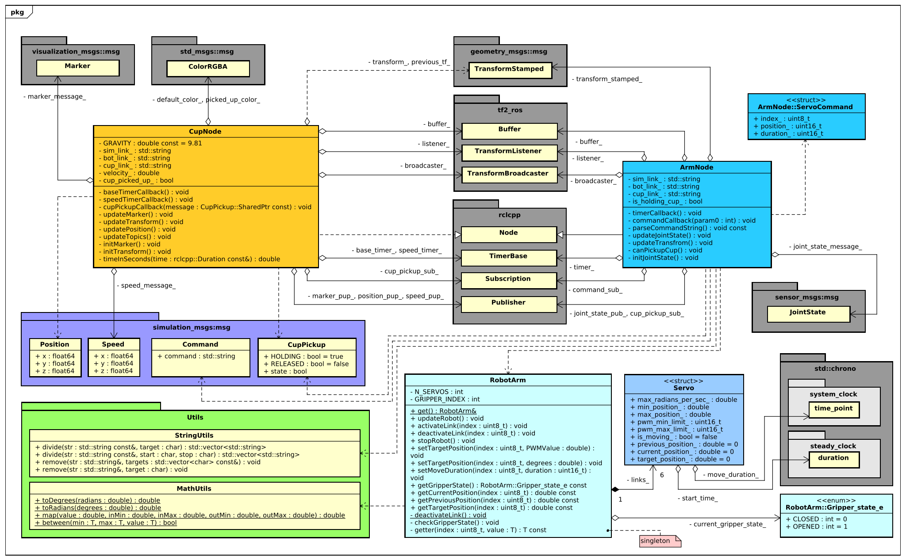
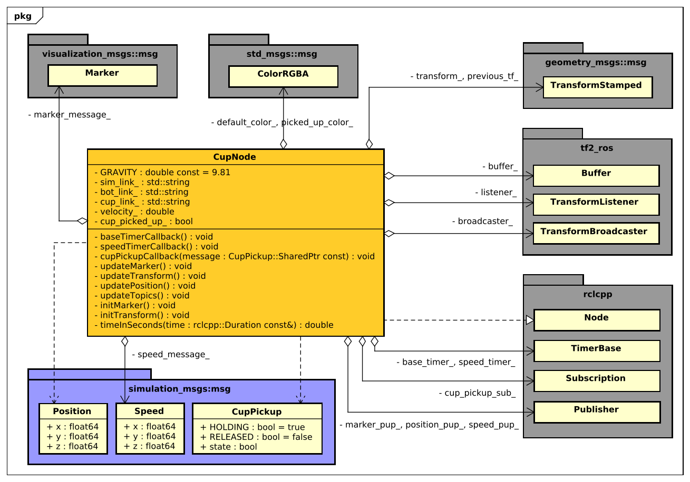
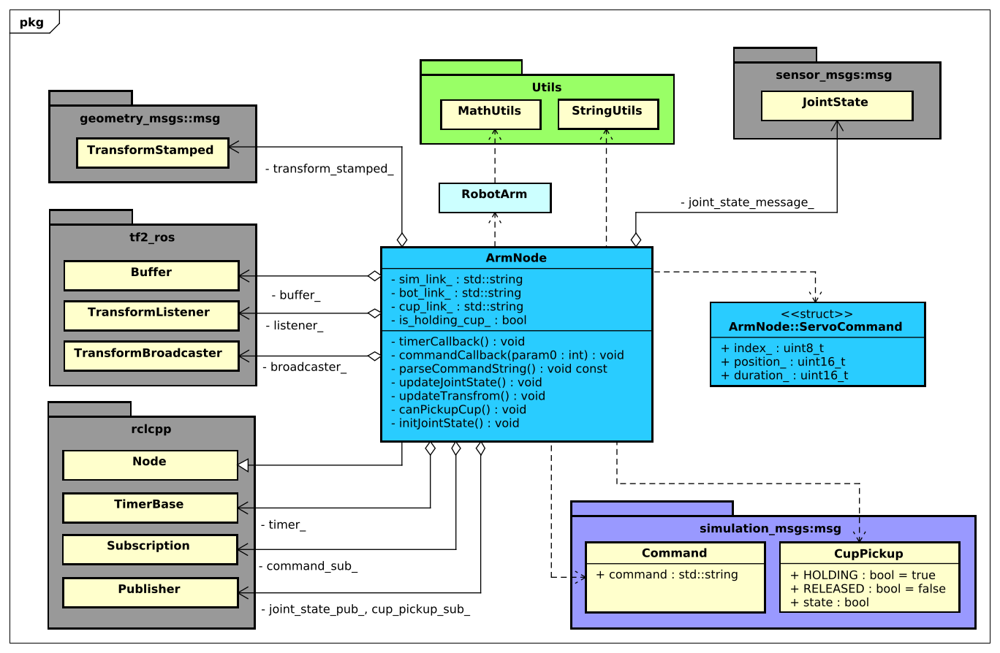
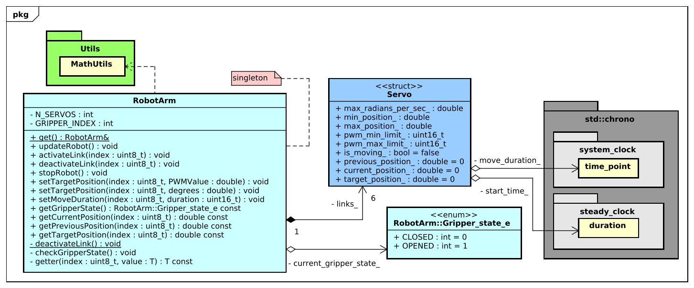

<br>
<br>

<div align="center">
    <h1 style="font-size:50px;"> 
        Robots - Simulatie 
    </h1>
    <h2 style="font-size:30px;">
        World of Robots
    <h2>
    

</div>


<br>
<br>


|                    |                                     |                      |                |
| :----------------- | :---------------------------------- | -------------------- | -------------- |
| **Auteur**         | Luke van Luijn                      | **Docent**           | Chris van Uffelen |
| **Student nummer** | 587478                              | **Plaats**           | Nijmegen       |
| **Opleiding**      | HBO-ICT                             | **Datum**            | 30-10-2022     |
| **Profiel**        | Embedded Software Development (ESD) | **Versie**           | 1.0            |
| **Studiejaar**     | Jaar 3                              |                      |                |

<div style="page-break-after: always;"></div>

<div style="page-break-after: always;"></div>

# Inhoudsopgaven

- 1 [Ontwerp](#chapter0)
	- 1.1 [Packages](#chapter1)
	- 1.2 [Applicatie](#chapter2)
		- 1.2.1 [Cup node](#chapter3)
		- 1.2.2 [Arm node](#chapter4)
		- 1.2.3 [RobotArm](#chapter5)
- 2 [Requirements](#chapter6)

<div style="page-break-after: always;"></div>

# 1. Ontwerp <a name="chapter0"></a>


In dit hoofdstuk zal dieper ingegaan worden op het ontwerp van de opdracht. Eerst zal de ros-structuur uitgelegd worden. Dit zal gebeuren aan de hand van een diagram die de samenhang tussen de verschillende nodes en topics weergeeft.

Vervolgens zal er dieper ingegaan worden op de samenhang van de broncode (source code). In dit onderdeel wordt aan de hand van verschillende diagrammen uitgelegd hoe de code in elkaar steekt.

## 1.1. Packages <a name="chapter1"></a>


De applicatie bestaat uit twee nodes; arm_node (weergegeven als: '*custom_arm_node*') en de cup_node (weergegeven als: '*custom_cup_node*').


**Diagram 1** - *ROS nodes & topics*

De arm_node luistert naar een topic genaamt */sim/controller/command*. Op dit topic kan de gebruiker van de applicatie en commando in de vorm van het AL5D protocol versturen. De arm_node reageert vervolgens op dit topic door joint_states te publiceren op het topic; */joint_states*.

De node; *robot_state_publisher* is een standaard node van ROS2 deze node luistert naar het eerder genoemde */joint_states* topic en genereerd op basis van die waardes een 'robot_discription', deze wordt gepubliseerd op het topic */robot_description*.

Zodra blijkt dat de arm het kopje aan het oppakken is zal de arm een publicatie doen naar het */sim/arm/cup_pickup* topic. Zodra de waarde van dit topic true is zal de cup_node weten dat deze opgepakt is door de robotarm en zal de positie van het kopje aanpassen op de positie van de gripper van de robotarm.

Verder is de cup_node verantwoordelijk voor het publiseren van drie onderdelen, ten eerste de positie; de cup_node bepaald en publiseert zijn positie naar het topic */sim/cup/position*. De gebruiker kan deze positie vervolgens uitlezen via de command line.

Het tweede onderdeel is de snelheid van het kopje. Het kopje bepaald zijn eigen snelheid ten opzichte van de wereld. De snelheid wordt gepubliseert op het topic */sim/cup/speed*. Dit topic wordt vervolgens uitgelezen door RQT (weergegeven als: */rqt_gui_py_node_48138*) en de waardes geplot in de GUI.

Het derde en laatste onderdeel waar de cup_node verantwoordelijk voor is is het publiseren van een marker. De marker is een visuele weergaven van het daadwerkelijke kopje. De marker wordt naar het topic */sim/cup/marker* gepubliseert.

<div style="page-break-after: always;"></div>

## 1.2. Applicatie <a name="chapter2"></a>


In dit onderdeel zal dieper ingegaan worden op de werking en samenhang van de applicatie. In de onderstaande afbeelding is het klasse diagram te zien van de gehele applicatie.



**Diagram 2** - *Class diagram: robot simulation*

<div style="page-break-after: always;"></div>

### 1.2.1. Cup node <a name="chapter3"></a>

De cup_node is verantwoordelijk voor het weergeven van de cup in Rviz. De weergaven van het kopje gebeurt aan de hand van een Marker ([visualization_msgs/msg/Marker](http://docs.ros.org/en/noetic/api/visualization_msgs/html/msg/Marker.html)). Zodra de robotarm het kopje oppakt zal het kopje de locatie van de marker gelijkstellen aan de locatie van de 'hand' van de robot en op deze manier met de robotarm meebewegen. Wanneer de robotarm laat weten dat het kopje losgelaten is zal het kopje terug naar de grond vallen.



**Diagram 3** - *Class diagram: cup node*

|#|Naam|Beschrijving|
|:---:|:---|:---|
|01|**GRAVITY**|Const voor het berekenen van de neerwaarste snelheid van de cup.|
|02|**default_color_**|De kleur van het kopje wanneer deze niet vastgehouden wordt.|
|03|**picked_up_color_**|De kleur van het kopje wanneer deze vastgehouden wordt.|
|04|**sim_link_**|Naam van het frame gebruikt in de simulatie.|
|05|**bot_link_**|Naam van het frame van de ArmNode klasse.|
|06|**cup_link_**|Naam van het frame van de CupNode klasse.|
|07|**velocity_**|De huidige neerwaarste snelheid van het kopje.|
|08|**cup_picked_up_**|True wanneer het kopje is opgepakt, false wanneer het kopje niet vastgehouden wordt.|
|09|**transform_**|Huidige transform van het kopje.|
|10|**previous_tf_**|Voorgaande transfrom van het kopje, wordt gebruikt voor het berekenen van de 3D snelheid van het kopje.|
|11|**marker_message_**|Het bericht dat gepubliseert wordt zodat het kopje weergegeven kan worden in Rviz.|
|12|**speed_message_**|Het bericht dat de snelheid van het kopje publiceert.|
|13|**buffer_**|Buffer die de verschillende transformaties bevat.|
|14|**listener_**|Luistert naar de verschillende transforms in de applicatie en plaatst deze in de buffer.|
|15|**broadcaster_**|Publiceert nieuwe transformaties.|
|16|**base_timer_**|Basis timer voor het updaten van de CupNode klasse (elke 10ms).|
|17|**speed_timer_**|Timer voor het publiceren van de snelheid van het kopje (elke 100ms).|
|18|**marker_pup_**|Publisher voor de marker berichten.|
|19|**position_pup_**|Publisher voor de position berichten.|
|20|**speed_pup_**|Publisher voor de speed berichten.|
|21|**cup_pickup_sub_**|Subscriber voor het CupPickup topic.|

**Tabel 1** - *CupNode: Members*

|#|Naam|Beschrijving|
|:---:|:---|:---|
|01|**baseTimerCallback**|Wordt aangeroepen elke 10ms, update de verschillende topics.|
|02|**speedTimerCallback**|Wordt aangeroepen elke 100ms, berekend de huidige snelheid van het kopje en publiseert deze.|
|03|**cupPickupCallback**|Wordt aangeroepen wanneer de robotarm publiseert naar het cup_pickup topic. Als het kopje momenteel opgepakt is zal het meebewegen met de arm. Als het kopje losgelaten is zal het naar de grond vallen.|
|04|**updateMarker**|Update de variablen van de marker_message_.|
|05|**updateTransform**|Update de variablen van de transform_.|
|06|**updatePosition**|Update de variablen van de position_message_|
|07|**updateTopics**|Update de verschillende topics (zie bovenstaand). |
|08|**initMarker**|Initialiseert de marker_message_.|
|09|**initTransform**|Initialiseert de transform_.|
|10|**timeInSeconds**|converteert een rclcpp::duration naar tijd in seconden (double).|

**Tabel 2** - *CupNode: Methods*

<div style="page-break-after: always;"></div>

### 1.2.2. Arm node <a name="chapter4"></a>

De arm node is verantwoordelijk voor het interperteren van de door de gebruiker verstuurde commando's. Verder is deze klasse verantwoordelijk voor het publiceren van de huidige staat van de robotarm, deze informatie wordt gepubliceert door middel van JointStates ([sensor_msgs/msg/JointState](http://docs.ros.org/en/noetic/api/sensor_msgs/html/msg/JointState.html)).

Zodra het commando voor het sluiten van de gripper is ontvangen zal de klasse checken of het toevallig op dezelfde locatie is met de gripper als het kopje. Als deze locaties hetzelfde zijn zal er een bericht gepubliceert worden naar het topic ```/sim/arm/cup_pickup```. Zodra de gripper weer opent zal er een bericht gestuurd worden naar hetzelfde topic.



**Diagram 4** - *Class diagram: arm node*

|#|Naam|Beschrijving|
|:---:|:---|:---|
|01|**transform_stamped_**|Huidige transform van de arm.|
|02|**buffer_**|Buffer die de verschillende transformaties bevat.|
|03|**listener_**|Luistert naar de verschillende transforms in de applicatie en plaatst deze in de buffer.|
|04|**broadcaster_**|Publiceert nieuwe transformaties.|
|05|**timer_**|Basis timer voor het updaten van de ArmNode klasse (elke 10ms).|
|06|**command_sub_**|Subscriber voor het ```/sim/controller/command``` topic.|
|07|**joint_state_pub_**|Publisher JointState berichten.|
|08|**cup_pickup_sub_**|Subscriber voor het ```/sim/arm/cup_pickup``` topic.|
|09|**joint_state_message_**|Bericht dat de JointStates van de robotarm publiceert.|
|10|**sim_link_**|Naam van het frame gebruikt in de simulatie.|
|11|**bot_link_**|Naam van het frame van de ArmNode klasse.|
|12|**cup_link_**|Naam van het frame van de CupNode klasse.|
|13|**is_holding_cup_**|True wanneer de robotarm het kopje vast heeft. False als de robotarm het kopje niet vast heeft.|

**Tabel 3** - *ArmNode: Members*

|#|Naam|Beschrijving|
|:---:|:---|:---|
|01|**timerCallback**|Update de huidige transform, joint states, de robotarm en controlleert of het kopje toevallig is opgepakt.|
|02|**commandCallback**|Wordt geactiveert zodra er een commando verstuurd is. Dit commando wordt geparsed en naar de robotarm verstuurd.|
|03|**parseCommandString**|Deze methode parsed het inkomende command bericht.|
|04|**updateJointStates**|Update de joint states op basis van de locatie van de robotarm.|
|05|**updateTransform**|Update het transform bericht.|
|06|**canPickupCup**|Checked of het kopje zich bevind tussen de gripper armen van de robotarm.|
|07|**initJointState**|Initialiseert het joint states bericht.|

**Tabel 4** - *ArmNode: Methods*

<div style="page-break-after: always;"></div>

### 1.2.3. RobotArm <a name="chapter5"></a>

De RobotArm klasse is in essentie een driver voor een daadwerkelijke AL5D robotarm. De klasse simuleert de verschillende servo's en geeft verschillende mogelijkheden voor het besturen van deze servo's.

De RobotArm klasse maakt gebruik van het singleton pattern. In de 'echte' wereld zou deze klasse een directe link zijn met hardware en zou het dus ook niet mogelijk zijn om meerdere instanties van deze klasse te hebben. Een singleton pattern zorgt ervoor dat dit ook daadwerkelijk toegepast wordt.



**Diagram 5** - *Class diagram: robotarm*

|#|Naam|Beschrijving|
|:---:|:---|:---|
|01|**N_SERVOS**|const waarde voor het aantal servo's in de robotarm.|
|02|**GRIPPER_INDEX**|const waarde voor de index van de servo gebruikt voor de gripper.|
|03|**links_**|Een vector met de verschillende servo's|
|04|**current_gripper_state_**|De huidige staat van de gripper (OPENEND / CLOSED)|

**Tabel 5** - *ArmNode: Members*

|#|Naam|Beschrijving|
|:---:|:---|:---|
|01|**get**|Get instance van de RobotArm klasse.|
|02|**updateRobot**|Triggered een update van de verschillendes servo posities op basis van tijd.|
|03|**activateLink**|Start een link zodat deze geupdate zal worden.|
|04|**deactivteLink**|Stop een link zodat deze niet meer geupdate zal worden.|
|05|**stopRobot**|Stop alle links van de robot (noodstop).|
|06|**setTargetPosition**|Zet een target positie van een servo.|
|07|**setMoveDuration**|Zet de tijdsduur van een beweging van een servo.|
|08|**getGripperState**| retourneer de huidige gripper state.|
|09|**getCurrentPosition**|retourneer de huidige positie van een servo.|
|10|**getPreviousPosition**|retourneer de vorige positie van een servo.|
|11|**getTargetPosition**|retourneer de target positie van een servo.|
|12|**deactivateLink**|Stop een link zodat deze niet meer geupdate zal worden.|
|13|**checkGripperState**|Check of de gripper momenteel gesloten of open is.|
|14|**getter**|Een algemene getter die eerst de servo index controleerdt en vervolgens de waarde retourneerd.|

**Tabel 6** - *ArmNode: Methods*

<div style="page-break-after: always;"></div>

# 2. Requirements <a name="chapter6"></a>


|  #   |  Prio  |      Behaald       | Beschrijving                                                                                                                                                                                                                                                                                                                                                                                                         |
|:----:|:------:|:------------------:|:---------------------------------------------------------------------------------------------------------------------------------------------------------------------------------------------------------------------------------------------------------------------------------------------------------------------------------------------------------------------------------------------------------------------|
| PA01 | Should | :heavy_check_mark: | De directory structuur beschreven in de ROS2 tutorial ( [creating a package](https://docs.ros.org/en/foxy/Tutorials/Beginner-Client-Libraries/Creating-Your-First-ROS2-Package.html) ) is aangehouden tijdens de ontwikkeling van het project.                                                                                                                                                                       |
| PA02 |  Must  | :heavy_check_mark: | Het project is getest en geschreven met/voor de colcon build tool gebruikt door ROS2.                                                                                                                                                                                                                                                                                                                                |
| PA03 |  Must  | :heavy_check_mark: | De verschillende classen en andere onderdelen van de code zijn geschreven aan de hand van in de OSM course geleerde OO principes.                                                                                                                                                                                                                                                                                    |
| PA04 | Should | :heavy_check_mark: | De styleguide is voorafgaand aan de ontwikkeling van het project doorgenomen en toegepast tijdens. Verder is de .clang-format gebruikt voor het formateren van de code volgens de door ros bepaalde opmaak ( [.clang-format](https://github.com/ament/ament_lint/blob/26397786f603b8e9e4c3c399c3d33b1c6873ee0d/ament_clang_format/ament_clang_format/configuration/.clang-format) )                                  |
| VS01 |  Must  | :heavy_check_mark: | Zoals beschreven in de handleiding kan de virtuele controller aangestuurd worden door middel van seriele commando's opgezet volgens de in de lynxmotion beschreven handleiding. De ondersteunde commando's zijn: P, positie per servo, S, tijd per positie en stop, (STOP), voor het uitvoeren van een noodstop.                                                                                                     |
| VS02 |  Must  | :heavy_check_mark: | De joint_state berichten van de robotarm worden gepubliceerd op het topic: /joint_states. Deze berichten kunnen worden ingezien door middel van het commando: ```ros2 topic echo /joint_states```                                                                                                                                                                                                                    |
| VS03 |  Must  | :heavy_check_mark: | Door het commando voor het starten van de rviz applicatie (beschreven in de handleiding) uit te voeren is het model van de AL5D robot te zien.                                                                                                                                                                                                                                                                       |
| VS04 |  Must  | :heavy_check_mark: | De verschillende servo's hebben ieder een maximale snelheid meegekregen (gebaseerd op de datasheet per servo). De snelheid wordt verder nog aangepast op basis van de meegegeven tijd in milliseconden voor het uitvoeren van een commando.                                                                                                                                                                          |
| VS05 | Should | :heavy_check_mark: | In het launch document [src/robot_simulation/launch/robot.launch.py](https://github.com/LukevLuijn/wor-simulation/blob/4c382b160dac39e8816105fc62bb3a63c29a7470/src/robot_simulation/launch/robot.launch.py#L13-L14) zijn twee variablen gedeclareerd (robot_pos_x & robot_pos_y) voor het bepalen van de positie van de robotarm. Deze variablen kunnen aangepast worden waardoor de robot zal verplaatsen in rviz. |
| VC01 | Should | :heavy_check_mark: | Zie VS05, de positie van de beker wordt bepaald op basis van de locatie van de robotarm.                                                                                                                                                                                                                                                                                                                             |
| VC02 |  Must  | :heavy_check_mark: | Door middel van een [marker](http://docs.ros.org/en/noetic/api/visualization_msgs/html/msg/Marker.html) wordt er een .stl document ([src/robot_simulation/model/wor_sim_cup.stl](https://github.com/LukevLuijn/wor-simulation/blob/4c382b160dac39e8816105fc62bb3a63c29a7470/src/robot_simulation/model/wor_sim_cup.stl)) van een beker gepubliceerd in Rviz                                                          |
| VC03 | Should |        :x:         | Deze eis is niet gerealiseerd.                                                                                                                                                                                                                                                                                                                                                                                       |
| VC04 | Could  |        :x:         | Deze eis is niet gerealiseerd.                                                                                                                                                                                                                                                                                                                                                                                       |
| VC05 | Should | :heavy_check_mark: | Zodra de robotarm de beker vastpakt veranderd de kleur van de beker van wit (255,255,255) naar cyan (0,255,255), [verwijzing](https://github.com/LukevLuijn/wor-simulation/blob/4c382b160dac39e8816105fc62bb3a63c29a7470/src/robot_simulation/src/cup_node.cpp#L80-L83).                                                                                                                                             |
| VC06 |  Must  | :heavy_check_mark: | Zodra de robotarm de beker vastpakt veranderd de locatie van de beker op basis van het middelpunt van de twee gripper armen, [verwijzing](https://github.com/LukevLuijn/wor-simulation/blob/4c382b160dac39e8816105fc62bb3a63c29a7470/src/robot_simulation/src/cup_node.cpp#L65-L78).                                                                                                                                 |
| VC07 |  Must  | :heavy_check_mark: | Zodra de beker niet vastgehouden word door de robotarm en de beker niet op de grond staat zal er zwaartekracht toegepast worden zodat de beker naar de grond toe valt, [verwijzing](https://github.com/LukevLuijn/wor-simulation/blob/4c382b160dac39e8816105fc62bb3a63c29a7470/src/robot_simulation/src/cup_node.cpp#L90-L101).                                                                                      |
| VC08 |  Must  | :heavy_check_mark: | De virtuele beker publiceert zijn positie naar een topic: ```/sim/cup/pose```. Dit topic kan uitgelezen worden door middel van het commando: ```ros2 topic echo /sim/cup/pose```.                                                                                                                                                                                                                                    |
| VC09 | Should | :heavy_check_mark: | De virtuele beker publiceert zijn snelheid naar een topic: ```/sim/cup/speed```. Dit topic kan uitgelezen worden door middel van het commando: ```ros2 topic echo /sim/cup/speed```.                                                                                                                                                                                                                                 |
| VC10 | Could  | :heavy_check_mark: | De actuele snelheid van de beker (hetzelfde als het topic) kan getoond worden in rqt_plot door middel van het volgende commando: ```rqt --perspective-file ~/wor_sim_review/src/robot_simulation/config/rqt_config.perspective```                                                                                                                                                                                    |
| DI01 |  Must  | :heavy_check_mark: | Er is een demo script opgesteld voor het demonstreren van de verschillende capaciteiten van de applicatie [demo.sh](https://github.com/LukevLuijn/wor-simulation/blob/4c382b160dac39e8816105fc62bb3a63c29a7470/demo.sh)                                                                                                                                                                                              |
| DI02 | Could  | :heavy_check_mark: | Zoals verteld bij eis VS05 is dit onderdeel opgenomen in het launch document.                                                                                                                                                                                                                                                                                                                                        |
| DI03 | Could  | :heavy_check_mark: | Zoals verteld bij eis VC01 is dit onderdeel opgenomen in het launch document.                                                                                                                                                                                                                                                                                                                                        |
| DM01 |  Must  | :heavy_check_mark: | Zie hoofdstuk: Handleiding/Installatie instructies.                                                                                                                                                                                                                                                                                                                                                                  |
| DM02 |  Must  | :heavy_check_mark: | Zie hoofdstuk: Handleiding/Bewegen van de robot.                                                                                                                                                                                                                                                                                                                                                                     |
| DM03 |  Must  | :heavy_check_mark: | Zie hoofdstuk: Handleiding/Requirements.                                                                                                                                                                                                                                                                                                                                                                             |
| DD01 |  Must  |        :heavy_check_mark:         | Zie hoofdstuk: Ontwerp/Packages.                                                                                                                                                                                                                                                                                                                                                                                                                 |
| DD02 |  Must  |        :heavy_check_mark:         | Zie hoofdstuk: Ontwerp/Applicatie.                                                                                                                                                                                                                                                                                                                                                                                                              |
| DD03 | Could  |        :x:         | Deze eis is niet gerealiseerd.                                                                                                                                                                                                                                                                                                                                                                                                         |
| DD04 | Should |        :heavy_check_mark:         | Zie hoofdstuk: Ontwerp/Applicatie.                                                                                                                                                                                                                                                                                                                                                                                                      |

**Tabel 7** - *Requirements*


