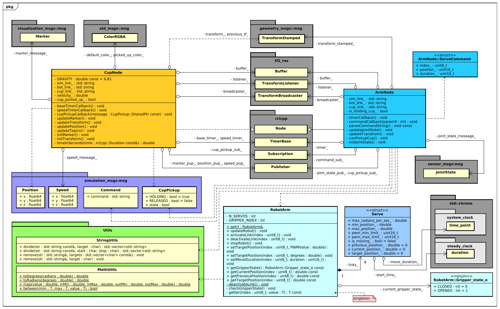
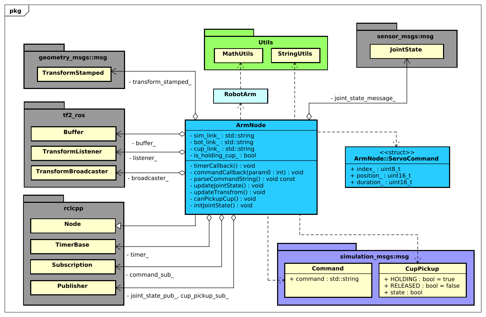

In dit onderdeel zal dieper ingegaan worden op de werking en samenhang van de applicatie. In de onderstaande afbeelding is het klassediagram te zien van de gehele applicatie.



**!diagram** - *Class diagram: robot simulation*

<div style="page-break-after: always;"></div>

### Cup node

De cup_node is verantwoordelijk voor het weergeven van de cup in Rviz. De weergaven van het kopje gebeurt aan de hand van een Marker ([visualization_msgs/msg/Marker](http://docs.ros.org/en/noetic/api/visualization_msgs/html/msg/Marker.html)). Zodra de robotarm het kopje oppakt zal het kopje de locatie van de marker gelijkstellen aan de locatie van de 'hand' van de robot en op deze manier met de robotarm meebewegen. Wanneer de robotarm laat weten dat het kopje losgelaten is zal het kopje terug naar de grond vallen.


**!diagram** - *Class diagram: cup node*

|#|Naam|Beschrijving|
|:---:|:---|:---|
|01|**GRAVITY**|Const voor het berekenen van de neerwaartse snelheid van de cup.|
|02|**default_color_**|De kleur van het kopje wanneer deze niet vastgehouden wordt.|
|03|**picked_up_color_**|De kleur van het kopje wanneer deze vastgehouden wordt.|
|04|**sim_link_**|Naam van het frame gebruikt in de simulatie.|
|05|**bot_link_**|Naam van het frame van de ArmNode klasse.|
|06|**cup_link_**|Naam van het frame van de CupNode klasse.|
|07|**velocity_**|De huidige neerwaartse snelheid van het kopje.|
|08|**cup_picked_up_**|True wanneer het kopje is opgepakt, false wanneer het kopje niet vastgehouden wordt.|
|09|**transform_**|Huidige transform van het kopje.|
|10|**previous_tf_**|Voorgaande transfrom van het kopje, wordt gebruikt voor het berekenen van de 3D snelheid van het kopje.|
|11|**marker_message_**|Het bericht dat gepubliceerd wordt zodat het kopje weergegeven kan worden in Rviz.|
|12|**speed_message_**|Het bericht dat de snelheid van het kopje publiceert.|
|13|**buffer_**|Buffer die de verschillende transformaties bevat.|
|14|**listener_**|Luistert naar de verschillende transforms in de applicatie en plaatst deze in de buffer.|
|15|**broadcaster_**|Publiceert nieuwe transformaties.|
|16|**base_timer_**|Basis timer voor het updaten van de CupNode klasse (elke 10ms).|
|17|**speed_timer_**|Timer voor het publiceren van de snelheid van het kopje (elke 100ms).|
|18|**marker_pup_**|Publisher voor de marker berichten.|
|19|**position_pup_**|Publisher voor de position berichten.|
|20|**speed_pup_**|Publisher voor de speed berichten.|
|21|**cup_pickup_sub_**|Subscriber voor het CupPickup topic.|

**!tabel** - *CupNode: Members*

|#|Naam|Beschrijving|
|:---:|:---|:---|
|01|**baseTimerCallback**|Wordt aangeroepen elke 10ms, update de verschillende topics.|
|02|**speedTimerCallback**|Wordt aangeroepen elke 100ms, berekend de huidige snelheid van het kopje en publiceert deze.|
|03|**cupPickupCallback**|Wordt aangeroepen wanneer de robotarm publiceert naar het cup_pickup topic. Als het kopje momenteel opgepakt is zal het meebewegen met de arm. Als het kopje losgelaten is zal het naar de grond vallen.|
|04|**updateMarker**|Update de variabelen van de marker_message_.|
|05|**updateTransform**|Update de variabelen van de transform_.|
|06|**updatePosition**|Update de variabelen van de position_message_|
|07|**updateTopics**|Update de verschillende topics (zie bovenstaand). |
|08|**initMarker**|Initialiseert de marker_message_.|
|09|**initTransform**|Initialiseert de transform_.|
|10|**timeInSeconds**|converteert een rclcpp::duration naar tijd in seconden (double).|

**!tabel** - *CupNode: Methods*

<div style="page-break-after: always;"></div>

### Arm node

De arm node is verantwoordelijk voor het interpreteren van de door de gebruiker verstuurde commando's. Verder is deze klasse verantwoordelijk voor het publiceren van de huidige staat van de robotarm, deze informatie wordt gepubliceerd door middel van JointStates ([sensor_msgs/msg/JointState](http://docs.ros.org/en/noetic/api/sensor_msgs/html/msg/JointState.html)).

Zodra het commando voor het sluiten van de gripper is ontvangen zal de klasse checken of het toevallig op dezelfde locatie is met de gripper als het kopje. Als deze locaties hetzelfde zijn zal er een bericht gepubliceerd worden naar het topic ```/sim/arm/cup_pickup```. Zodra de gripper weer opent, zal er een bericht gestuurd worden naar hetzelfde topic.



**!diagram** - *Class diagram: arm node*

|#|Naam|Beschrijving|
|:---:|:---|:---|
|01|**transform_stamped_**|Huidige transform van de arm.|
|02|**buffer_**|Buffer die de verschillende transformaties bevat.|
|03|**listener_**|Luistert naar de verschillende transforms in de applicatie en plaatst deze in de buffer.|
|04|**broadcaster_**|Publiceert nieuwe transformaties.|
|05|**timer_**|Basis timer voor het updaten van de ArmNode klasse (elke 10ms).|
|06|**command_sub_**|Subscriber voor het ```/sim/controller/command``` topic.|
|07|**joint_state_pub_**|Publisher JointState berichten.|
|08|**cup_pickup_sub_**|Subscriber voor het ```/sim/arm/cup_pickup``` topic.|
|09|**joint_state_message_**|Bericht dat de JointStates van de robotarm publiceert.|
|10|**sim_link_**|Naam van het frame gebruikt in de simulatie.|
|11|**bot_link_**|Naam van het frame van de ArmNode klasse.|
|12|**cup_link_**|Naam van het frame van de CupNode klasse.|
|13|**is_holding_cup_**|True wanneer de robotarm het kopje vast heeft. False als de robotarm het kopje niet vast heeft.|

**!tabel** - *ArmNode: Members*

|#|Naam|Beschrijving|
|:---:|:---|:---|
|01|**timerCallback**|Update de huidige transform, joint states, de robotarm en controleert of het kopje toevallig is opgepakt.|
|02|**commandCallback**|Wordt geactiveerd zodra er een commando verstuurd is. Dit commando wordt geparsed en naar de robotarm verstuurd.|
|03|**parseCommandString**|Deze methode parsed het inkomende command bericht.|
|04|**updateJointStates**|Update de joint states op basis van de locatie van de robotarm.|
|05|**updateTransform**|Update het transform bericht.|
|06|**canPickupCup**|Checked of het kopje zich bevindt tussen de gripper armen van de robotarm.|
|07|**initJointState**|Initialiseert het joint states bericht.|

**!tabel** - *ArmNode: Methods*

<div style="page-break-after: always;"></div>

### RobotArm

De RobotArm klasse is in essentie een driver voor een daadwerkelijke AL5D robotarm. De klasse simuleert de verschillende servo's en geeft verschillende mogelijkheden voor het besturen van deze servo's.

De RobotArm klasse maakt gebruik van het singleton pattern. In de 'echte' wereld zou deze klasse een directe link zijn met hardware en zou het dus ook niet mogelijk zijn om meerdere instanties van deze klasse te hebben. Een singleton pattern zorgt ervoor dat dit ook daadwerkelijk toegepast wordt.


**!diagram** - *Class diagram: robotarm*

|#|Naam|Beschrijving|
|:---:|:---|:---|
|01|**N_SERVOS**|const waarde voor het aantal servo's in de robotarm.|
|02|**GRIPPER_INDEX**|const waarde voor de index van de servo gebruikt voor de gripper.|
|03|**links_**|Een vector met de verschillende servo's|
|04|**current_gripper_state_**|De huidige staat van de gripper (OPENEND / CLOSED)|

**!tabel** - *ArmNode: Members*

|#|Naam|Beschrijving|
|:---:|:---|:---|
|01|**get**|Get instance van de RobotArm klasse.|
|02|**updateRobot**|Triggered een update van de verschillende servo posities op basis van tijd.|
|03|**activateLink**|Start een link zodat deze geüpdatet zal worden.|
|04|**deactivteLink**|Stop een link zodat deze niet meer geupdate zal worden.|
|05|**stopRobot**|Stop alle links van de robot (noodstop).|
|06|**setTargetPosition**|Zet een target positie van een servo.|
|07|**setMoveDuration**|Zet de tijdsduur van een beweging van een servo.|
|08|**getGripperState**| retourneer de huidige gripper state.|
|09|**getCurrentPosition**|retourneer de huidige positie van een servo.|
|10|**getPreviousPosition**|retourneer de vorige positie van een servo.|
|11|**getTargetPosition**|retourneer de target positie van een servo.|
|12|**deactivateLink**|Stop een link zodat deze niet meer geupdate zal worden.|
|13|**checkGripperState**|Check of de gripper momenteel gesloten of open is.|
|14|**getter**|Een algemene getter die eerst de servo index controleert en vervolgens de waarde retourneert.|

**!tabel** - *ArmNode: Methods*